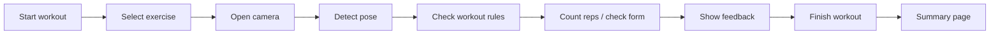

# Workout Detection Flow

Most simple left-to-right version of the workout detection process.

```mermaid
flowchart LR
    A["Start workout"] --> B["Select exercise"]
    B --> C["Open camera"]
    C --> D["Detect pose"]
    D --> E["Check workout rules"]
    E --> F["Count reps / check form"]
    F --> G["Show feedback"]
    G --> H["Finish workout"]
    H --> I["Summary page"]
```
